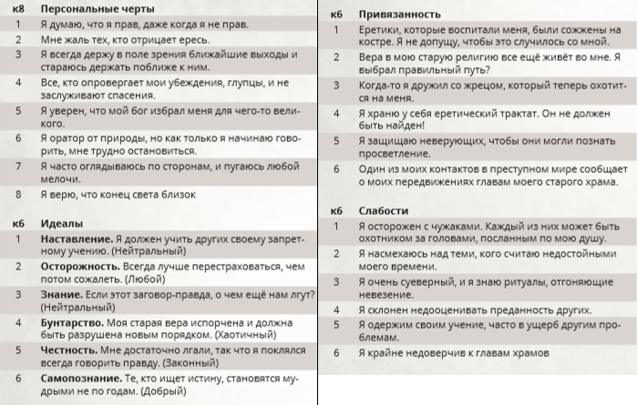

# Предыстория персонажа - Еретик
_Источник: Xanathar's Lost Notes to Everything Else (Homebrew дополнение от DM's Guild)._  
_Перевод [dungeons_ru](https://vk.com/dungeons_ru)_

Вы верите в доктрину, запрещённую вашей церковью, которой вас тайно научили другие еретики. Возможно, вас отлучили от вашего
храма, или запрещённая догма предоставила ответы на те вопросы, о которых вы никогда раньше и не думали.
Каким бы ни было ваше происхождение, вас теперь избегают верующие или, что ещё хуже, они охотятся на вас.

**Владение навыками:** Обман, Религия

**Языки:** Два на ваш выбор

**Снаряжение:** священный символ (слегка изменённый для представления вашей собственной еретической веры), молитвенник,
облачение, бутылка невидимых чернил, перо, комплект обычной одежды и поясной кошель с 10 зм.

## Умение: Связи еретика
Вы знаете, где найти еретиков в поселениях, где имеется ваша вера. Если еретиков нет, вы можете внушить слабохарактерным людям
свою веру, если вы проводите день проповедуя. Там, где присутствуют еретики, вы всегда можете найти место, где можно спрятаться,
отдохнуть и восстановиться. При необходимости они могут помочь вам сбежать из поселения на повозке или через секретный туннель.

## Персонализация
Еретики выживают, проводя свою жизнь в бегах, или сливаясь с массами последователей большей веры. Они склонны быть
подозрительными людьми с ревностными идеалами и непоколебимыми убеждениями. Это иногда проявляется как чувство превосходства
над «непосвящёнными».

